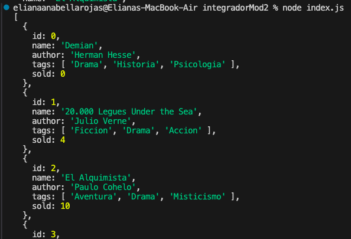
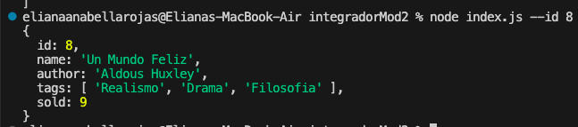
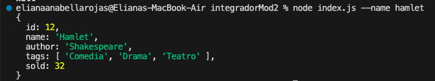
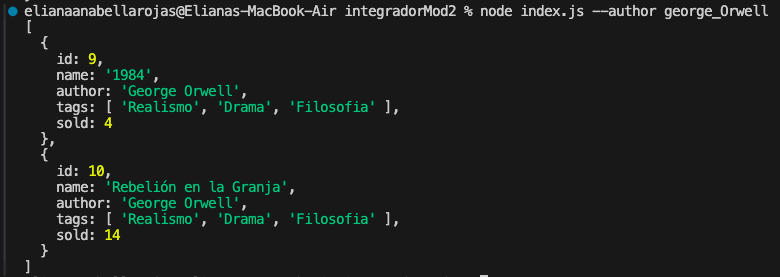
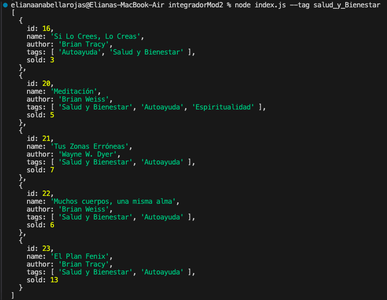
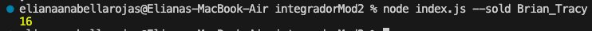
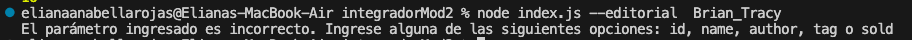

# DESAFÍO INTEGRADOR - MODULO 2

---

## Ambito y alcance

La aplicación desarrollada en este desafío integrador nos permite acceder a una base de datos y realizar distintas peticiones de información según los parámetros que ingrese el usuario por parámetro al llamar a index.js.

## Arquitectura

La app esta formada por tres módulos:

- index.js 
    Consiste en una collection que contiene la data que sera consultada en la aplicación.
- books.js 
    En donde definimos la lógica de las funciones que actúan sobre DB.js. 
- DB.js
    Encargado de recibir y procesar los parámetros desde la terminal al ejectutar el archivo principal.

---

## Instrucciones de uso

> Con dos guiones medios denotamos el nombre de la propiedad. Ej.: `--id` 
> Con el guion bajo denotamos los espacios entre palabras que se encuentran en una cadena de texto(string) cuando necesitamos ingresar el valor de la propiedad que pasamos por parámetro. Ej.: `La_Tempestad`

Como usuario de la aplicación usted puede realizar las siguientes peticiones a través de la terminal(consola, linea de comandos), como se indica a continuación:

- Obtener información de todos los libros de la base de datos.
        `node index.js`

*En este caso solo se pasan los dos parámetros iniciales, es decir con lo que iniciaran todas las peticiones*

Ejemplo:

- Buscar un libro por id.
        `node index.js --id integer`
    
    **integer** : número entero que represente el id del libro a buscar.

Ejemplo:

- Buscar un libro por nombre. Se obtienen todos los libros que incluyen el texto enviado en el parámetro.
    `node index.js --name name_book`
**name_book**: nombre del libro a buscar.

Ejemplo:

- Buscar todos los libros de un autor. Se obtienen todos los libros que incluyen el texto enviado en el parámetro.
    `node index.js --author authors_name`
    **authors_name**: nombre del autor cuyos libros se desean buscar.

Ejemplo:

- Buscar todos los libros asociados a una etiqueta ( ej.: Drama, Autoayuda, Ciencia Ficción, etc.).
    `node index.js --tag tag_name`
    **tag_name**: nombre de la etiqueta que se pasa en el parámetro.

Ejemplo:

- Consultar el total de libros vendidos por un autor.
    `node index.js --sold authors_name`
    **authors_name**: nombre del autor sobre el que se requiere calcular el total de libros vendidos.

Ejemplo:

- Si se ingresa cualquier otro parámetro, se muestra el siguiente mensaje de error:

